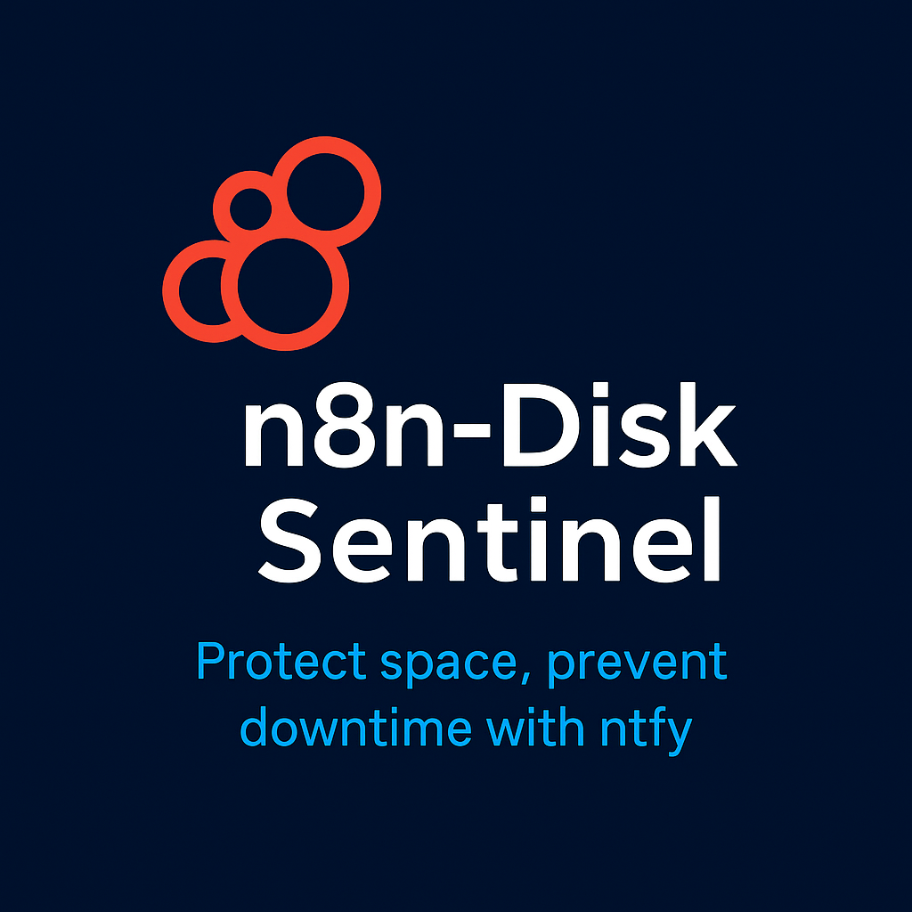

<p align="center">
  
</p>

<h1 align="center">n8n-Disk Sentinel</h1>

<p align="center">
  A lightweight n8n automation to monitor Linux disk space and send ntfy alerts when a critical threshold is exceeded.
</p>

<p align="center">
  <a href="https://ko-fi.com/s/60ece3037f">
    
  </a>
</p>

<p align="center">
  
  
  
  
</p>

---

> Nodes (high level): Manual Trigger → Exec `df` → Function (parse/format) → IF threshold → HTTP `ntfy` Alert + HTTP `ntfy` Report.

## What it does

- Runs `df -P -B1 --output=source,fstype,size,used,avail,pcent,target`.
- Filters out virtual filesystems (`tmpfs`, `devtmpfs`, `squashfs`, `overlay`).
- Calculates free percentage and builds a compact Markdown table (GiB/TiB).
- Sends:
  - **Report**: a readable Markdown report to your ntfy topic.
  - **Alert**: when any mount’s free % is below a threshold (default in the Function node logic).

## Repo layout

```
n8n-disk-check-glaciar-public/
├─ workflows/
│  └─ disk_check_FULL.json
├─ scripts/
│  └─ import.sh
├─ LICENSE
├─ .gitignore
└─ README.md
```

## Import into n8n

### UI
1. n8n → **Workflows** → **Import from File**.
2. Choose `workflows/disk_check_FULL.json`.
3. Open the workflow and update:
   - **ntfy topic URL** (use your own, e.g., `https://ntfy.sh/<your-topic>`).
   - (Optional) Replace **Manual Trigger** with a **Cron** node for your schedule.

### CLI (optional)
```bash
# from repo root
./scripts/import.sh
```

## Customize

- **Threshold**: In the **Function** node, change the comparison (example):  
  `overallLow = vols.some(v => v.freePct < <THRESHOLD>);`
- **Ignore list**: Adjust `tmpfs`, `devtmpfs`, `squashfs`, `overlay` to your needs.
- **Timezone**: Set the workflow timezone to match your environment.
- **ntfy topic**: Replace `https://ntfy.sh/<your-topic>` with your topic or self‑hosted instance.

## Security notes

- The Exec node runs a shell command; deploy only on trusted n8n workers.
- If your ntfy server is private, add `Authorization` in the HTTP nodes.

## GitHub Quick start

Choose HTTPS **or** SSH.

**HTTPS** (use a Personal Access Token when prompted):
```bash
git init
git add .
git commit -m "feat: n8n disk check workflow with ntfy alerts"
git branch -M main
git remote add origin https://github.com/<your-username>/n8n-disk-check-glaciar.git
git push -u origin main
```

### SSH alternative
```bash
git init
git add .
git commit -m "feat: n8n disk check workflow with ntfy alerts"
git branch -M main
git remote add origin git@github.com:<your-username>/n8n-disk-check-glaciar.git
git push -u origin main
```

---

Built from the provided workflow JSON. See `workflows/disk_check_FULL.json`.
